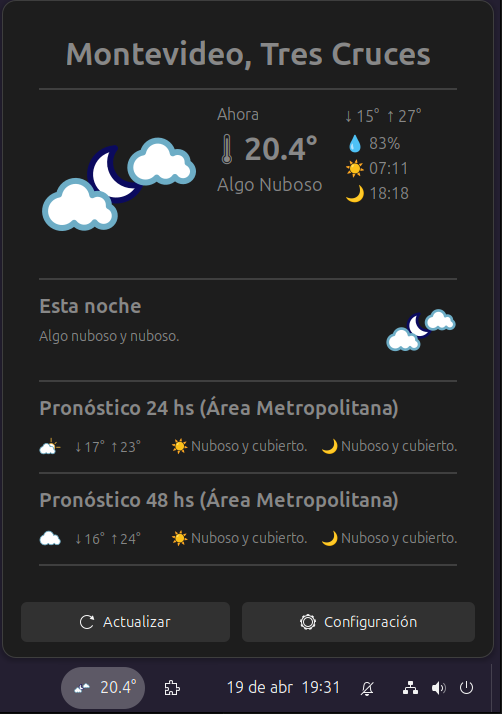
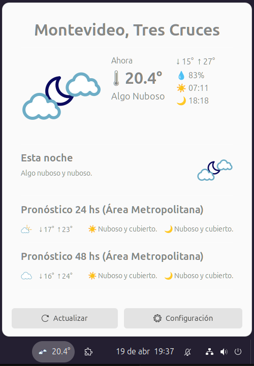
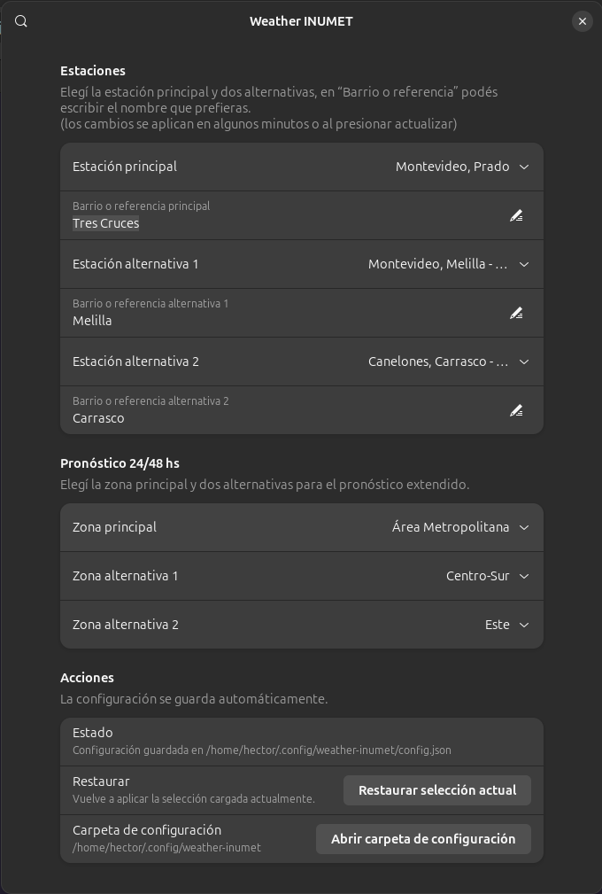

# Clima INUMET para GNOME

Extensión para GNOME que muestra el **clima actual y pronóstico** utilizando datos oficiales del **INUMET (Uruguay)** directamente en el panel.

---

## 📌 Descripción

Esta extensión integra información meteorológica en GNOME Shell:

* 🌡️ Temperatura actual
* ☁️ Estado del cielo
* 💧 Humedad
* 🌅 Salida del sol
* 🌇 Puesta del sol
* 📊 Pronóstico a corto plazo

Los datos provienen del **Instituto Uruguayo de Meteorología (INUMET)**.

## 📸 Capturas

### Tema oscuro


### Tema claro


### Configuración


---

## 🎯 Enfoque del proyecto

Este proyecto está orientado a:

* Usuarios de **Linux**
* Entorno **GNOME Shell**
* Personas que viven en **Uruguay 🇺🇾**

No es una solución global, sino una herramienta práctica basada en datos locales oficiales.

---

## 👨‍💻 Autor

**Héctor De Armas (dejotaerre)**

Proyecto personal enfocado en integrar servicios locales en el escritorio Linux de forma simple y directa.

---

## ⚙️ Requisitos

* GNOME Shell (46+ recomendado)
* Python 3
* Conexión a Internet

> ⚠️ Nota sobre compatibilidad:
>
> La extensión no ha sido probada en GNOME 50 al momento de escribir esto.
> Sin embargo, es muy probable que funcione correctamente sin cambios.

---

## 📦 Instalación

### 1. Clonar repositorio

```bash
git clone https://github.com/dejotaerre/gnome-clima-inumet.git
cd gnome-clima-inumet
```

---

### 2. Instalar la extensión

```bash
mkdir -p ~/.local/share/gnome-shell/extensions/weather-inumet@local
cp -r * ~/.local/share/gnome-shell/extensions/weather-inumet@local/
```

---

### 3. Reiniciar GNOME Shell

#### En Wayland (Ubuntu 24.04, recomendado)

Cerrar sesión y volver a entrar.

#### En X11

```bash
Alt + F2 → r → Enter
```

---

### 4. Activar la extensión

```bash
gnome-extensions enable weather-inumet@local
```

Verificar estado:

```bash
gnome-extensions list | grep inumet
```

---

## ⚙️ Configuración

Archivo:

```text
data/config.json
```

Permite:

* Elegir estación (ej: Prado)
* Ajustar parámetros del script
* Personalizar comportamiento

---

## 🧪 Debug (muy útil)

Si algo no funciona:

```bash
journalctl -f | grep -i inumet
```

O revisar errores de GNOME:

```bash
journalctl /usr/bin/gnome-shell -f
```

---

## 📁 Estructura del proyecto

```text
.
├── extension.js
├── prefs.js
├── metadata.json
├── stylesheet.css
├── screenshots
└── data/
    ├── config.json
    ├── weather.inumet.py
    └── svg/
```

---

## ⚠️ Notas

* Proyecto **no oficial** de INUMET
* Depende de endpoints públicos
* Puede romperse si cambian APIs

---

## 📜 Licencia

MIT

---

## 🤝 Contribuciones

Bienvenidas mejoras, ideas o reportes de errores.

---

## 🇺🇾 Hecho en Uruguay

Para quienes queremos ver el clima local sin depender de servicios externos innecesarios.
